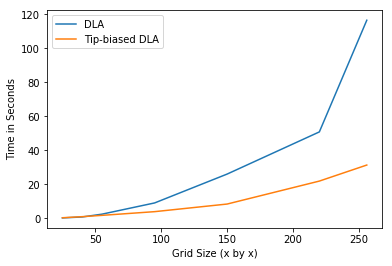
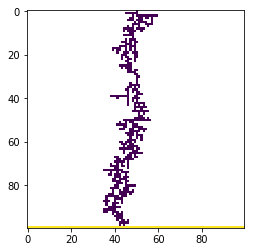
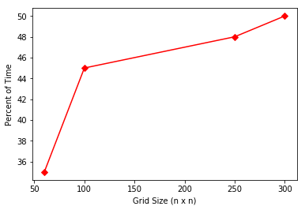
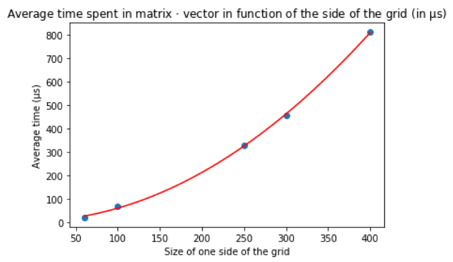
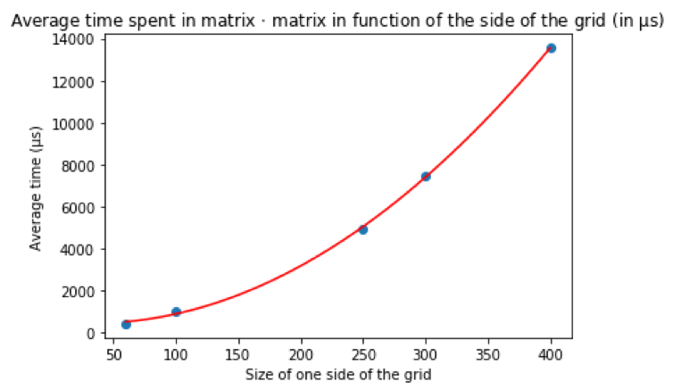
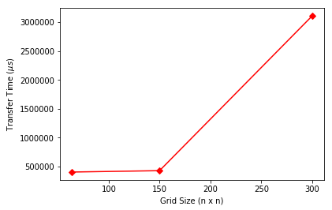

# Abstract

Fractal growth is a computationally intensive simulation which has typically ignored traditionoal first principles in physics in order to increase speed. Lightning is a well understood phenomena that can be simulated accurately with the Dielectric Breakdown Model, but it is computationally expensive to do so. We seek to optimize this simulation with HPC through the parallelization of the simualtion at each time step using a multi-core and -node architecture on Google Cloud Engine. Using this approach, we obtained a non-trivial speedup and amanged to simulate lightning growth on a 1400x1400 grid.


# Problem Statement
One of the biggest promises of HPC is allowing for realistic modelling of the physical world. This pursuit is nontrivial, as physical descriptors of nature often require high-dimensional space, big data, and intensive computations that do not scale well as spatial or temporal resolution are increased. Models often trade off performance for accuracy as they grow in complexity. One such domain is the use of computing to simulate lightning dispersion as is nucleates from a point in the air towards the ground. These models either rely on naive toy models that essentially propagate a point towards the ground randomly, or physical models that rely on electrodynamics and fractal growth to efficiently simulate lightning dispersion. The aim is to implement the physical model through first principles while offseting some of the computing and scaling bottlenecks through HPC principles. 

Fractal growth is a computationally intensive simulation which has typically ignored traditionally first principles in physics in order to increase speed despite the fact that these growth patterns can be found in a wide-range of of phenomenon from biology to physics and chemistry. Lightning is a well understood phenomena that can be simulated accurately with the Dielectric Breakdown Model, but it is computationally expensive to do so. This model relies on solving discretized differential equations on enormous grids with unfavorable scaling. This has bottlenecked any sort of physical implementation. 

In order to accurately simulate lightning based on first-principles, the Dielectric Breakdown Model is used. In this method, the charge distribution over a given grid is calculated by solving the Poisson equation. However, solving this partial differential equation is compuataionally expensive, requiring an expansion of the grid used. In order to solve for the growth at each time step on a 100 x 100 grid, one must solve for the dot product of a 10,000x10,000 matrix and a 10,000 element vector (or another square matrix). Obviously, this $O(N^2)$ scaling is inefficient but luckily matrix operations are easily parallelizable in theory. 


# Previous Work

Lightning is a form of electric discharge and grows in a fractal pattern. This occurs when there is a a large enough chage between two objects. In many cases, and in the case of our simulations, this is the difference in a cloud of electrons and the ground. It begins with an initial negative charge distribution, the initial breakdown and then expands to another point, creating another breakdown. This extension from the initial breakdown to the point with the largest difference is known as the stepped leader. The entire process is quick; it only takes around 35ms (CITE). However, the process rapidly iterates with the negative charges of the first stepped leader laying the groundwork for subsequent bolts. Each bolt follows in the path of . the previous, albeit much faster (1-2ms) given the bias of the first stepped-leader. Moreover,  given the fractal pattern lightning ultimately achieves, it is classified as Laplacian growth. This is critical to much early work as Laplacian growth is a well understood concept and many approaches can yield accurate shapes. These two features of lightning, stepped leader behavior and laplacian growth, are the two primary targets of previous work in the area. 

In the past, lightning simulations  have been forced to choose between two paradigms: accurate models or efficient models. In accurate modeling, first-principles are used in order to more-accurately depict the growth of a lightning ray. However,  as mentioned above, this typically result in computationally slow models. On the other hand, lightning growth can be simulated for human observation simply by approximating the shape. These models are appealing to look at, and can grow quite large, but often lack any form of phyciscal principle: they are just fast and generate results that resemble lightning. 

## Diffusion Limited Aggregation (DLA)


To simulate only the shape, one possible appraoch is diffusion limited aggregation (DLA). In this method, there are five critical steps to understand:

1. A point charge is distributed randomly on a grid of an arbitrary size.
2. A second point is randomly chosen on the grid to begin a random walk. 
3. The second point is allowed to walk until it is within one grid-space of the initial charge.
4. With some probability $S$, the walker "sticks" to the charge. If it does not stick, it is allowed to continue to walk.
5. The process is repeated until the given number of "steps" (walks) have occurred.

Using the above method, one is able to accurately simulate the growth of fractal patterns and laplacian growth. The model is incredibly fast on small, two-dimension girds, as the computer must only randomly draw the direction of the random walk. This allows for rapid simulations compared to other methods, taking only (INSERT TIME).

However, the model breaks down in two critical ways: it scales poorly and it does not accurately simulate the shape of lightning (see below image). Given the model is essentially a series of random walks, it takes far longer on larger grid sizes and even worse in high-dimension spaces. The root mean squared distance a random walk travels is actually the square root of the number of time steps in one dimension. 

$$
    RMSD = \sqrt{N}
$$

In two dimensions, the walk takes even longer given there are now two axes to walk along. In three, it is even more difficult for a random walk to "stick to" the initial charge as it has to probabalistically reach the single point in an ever-expanding space.

The second criticism of the model can be remedied with tip-biasing, an approach developed to specifically model lightning's directionally-biased nature. In tip-biased DLA, the probability of the walker starting from a given point is inversely correlated with its distance from the tip of the stepped leader. It does not force the lightning in one direction, but allows it to grow in that direction with a greater probability. A normal distribution models the probability of starting from a point $n$ spaces from the tip, with the probability maximized at $n = k$. A sample distribution for k =  3 is shown below:

| Distance    | 0 |  1 |  2 | 3 |  4 |  5 | 6 |
|-------------|---|:--:|:--:|:-----:|:--:|:--:|---|
| Probability | 0 | .1 | .2 |   .4  | .2 | .1 | 0 |

This also helps remedy the scaling issue as the tip-bias dictates the random walk does not have to walk nearly as far. Thus,  the method helps to remedy the two aforementioned issues with DLA, but still does not take into account physical first-principles. 


The above figure is a comparison of runtimes for tip-biased DLA and normal DLA runtimes.



In the above image, the extreme branching pattern of tip-biased DLA can be seen, far less accurate than other methods in terms of shape, but still not as inaccurate as normal DLA.


## Dielectric Breakdown Model


The dielectric breakdown model is a method for simulating lightning with first-principles in mind. The algorthm can be summarized in the following steps:

1. Randomly select an initial charged point on a grid.
2. Solve a discretization of the Poisson equation to determine the potential grid and determine the charge difference between the stepped leader and all points on the grid. 
3. The largest differences on the grid are the most probable to be the grids to which the stepped leader "jumps." This is considered a "step."
4. Repeat steps 2 and 3 until the lightning reaches the "ground" (bottom of the grid).

Step two is the most computationally intensive. In order to calculate the potential grid from the initial point to the ground, we must solve  the Laplacian equation, derived from Maxwell's equations for an electric field:

$$\nabla ^2 \phi = 0$$

With two-dimensional finite-differences, we have:

$$  \nabla ^2 \phi_{i,j} 
    = \left(\frac{\partial^2}{\partial x^2}+\frac{\partial^2}{\partial y^2}\right)\phi_{i,j} \\
   \nabla ^2 \phi_{i,j}  = \frac{\phi_{i,j+1}+\phi_{i+1,j}-4\phi_{i,j}+\phi_{i-1,j}+\phi_{i,j-1}}{h^2}$$
    
From the above, we get . an equation for each point on the grid, meaning we get $n\times n$ linear equationos for an $n \times n$ grid. $phi$ is a dense vector of length $n$. This can be represented as the matrix product: 

$$L_{n\times n}\cdot \phi = 0$$

This system of linear equations is where we get the $O(N^2)$ complexity we see in the computational runtimes. With a grid of 128, we get $128 \times 128$ equations and thus have a $128^2 \times 128^2$ matrix. 


We can use numerous techniques to solve this, but in the current implementation, we use the Incomplete Poisson Conjugate Gradient (IPCG) method (pseudocode below). This method is similar to the Incomplete Cholesky Conjugate Gradient (ICCG) method but uses a Poisson-specific preconditioner. 


The intircaes (<--- WAT?) of the above approach are not critical to understand in the context of this paper. Essentially, the above method and the Poisson preconditioner allow for only a single matrix muliplication operation is needed at a given iteration of the conjugate gradient. The preconditioner ensures convergence and thus accelerates the simulation of lightning. 

The probability of a given point being the next point the stepped leader jumps to is directly proportional to its charge:

$$ p_j = \frac{(\phi_j)^\eta}{\sum_{i \in I}(\phi_i)^\eta} $$

$\eta$ is a branching hyperparameter. For the purposes of this report, it is not relevant but it essentially controls the probability of branching in the simulation.  A greater $\eta$ value dictates a straighter stepped leader. The value used in these simulations is 4. 

However, as with DLA, this method scales poorly with problem size as the linear equation solution gets more and more complicated.


# Model Origins

The above methods, tip-biased DLA and DBM with IPCG were both implemented for the final project of AM205. However, these methods proved to be both incredibly memory intensive and computationally slow. Simulting (INSERT DATA HERE). Even with these improvements over the original implementations of the respective algorithms, the problem could still be solved more efficiently. When implemented, High Performance Computing was not considered and all simulations were generated on local machines. As such, selecting these models to apply HPC to was a natural decision.

However, after some initial analysis, it appeared DBM was a far better candidate for optimization than DLA. The reason for this is simple: DLA is extermely sequential. The two processes, stepped leader growth and random walks, both explicitly rely on previous steps.  The next step of the growth leader cannot be predicted without the last and the process of a random walk implicitly depends on previous steps in the random walk to calculate the next. As such, DLA was discarded.

With DBM, there is still an explicit dependence from step to step, but the process of determining the next step of the stepped leader at a given timepoint is not sequential in nature. In DLA, a random walk, the method of determining the next step, cannot be parallelized but in DBM the solving of the linear equation can be. Thus, we focused our efforts on this equation. 


# Goal

Rendering visually appealing lightning is the goal and as such we needed to generate lightning on a 1400x1400 grid, which is similar to the resolution of standard HD screens (1920×1080). Ultimately, our we sought to optimize this simulation with HPC through the parallelization of the simulation along the time domain using a multi-thread, multi-node architecture on Google Cloud Engine and Amazon Web Services. Using this approach, we obtained a non-trivial speedup and managed to simulate lightning growth on a 1400x1400 grid. 

# Profiling

An important first step was profiling. Contrarily to other projects which started from the ground up, our goal was to optimize an existing codebase. Even though our intuition led us to believe that we should for instance first parallelize complex matrix operations like matrix multiplications, it was crucial to profile the existing code to find where layed the bottlenecks. This investigative work was crucial, as it turned out that one operation that we took for granted was in fact monopolizing almost 50% of the total execution time!

Initial profiling of the code revealed a massive bottleneck in the dot product used in the IPCG method. This method accounted for over 40% of the computation time and scaled poorly with grid size. Thus, we sought to optimize this step in particular. However, we quckly ran into a problem with this approach: the operation was already highly optimized.

During the original implementation of DBM, the choice was made to use sparse matrices to drastically increase the speed of matrix operations, and inversely to reduce the memory footprint. This accomplished the goal of speeding up operations, but also meant our baseline code was already extremely fast. Moreover, we leveraged the numpy library further speedup the operations. Under the hood, numpy compiles in C++ and parallelizes many basic operations. We realized that while monitoring the CPU usage of the baseline algorithm; it would spike beyond what a single-core algorithm could achieve. Indeed, we could see its usage reaching 300 to 400%. Thus, for all intents and purposes, the code was already semi-parallelized. 





On top of that, the bottleneck was not due to the operation taking a long time to complete, but rather the sheer number of calls (see Table 1). On a 100x100 grid, the mat-vec dot product does take 6.19s, but it is called 88,200 times (for an average time of only $69\mu s$); on 250x250 grids, it is called 362,086 times; on 400x400 grids, over 400,000 times, averaging $811\mu s$. In terms of execution time per call, mat-mat products are indeed very slow, especially compared to mat-dot products. However, their relative importance in terms of total execution time is much less important than mat-dot products, due to the simple fact that it is called much less often. From initial profiling, it was clear that our focus had to be on mat-vec products, not on mat-mat products. The problem we faced with optimizing this operation by parallelizing it is its inherent initial cost; on such a short timescale to improve, serialization and communication overheads incurred, to name a few, can rapidly negate any benefits of parallelism.

|                                                 	| 100x100 	| 250x250 	| 300x300 	| 400x400 	|
|-------------------------------------------------	|:-------:	|:-------:	|:-------:	|:-------:	|
| Total time in mat-vec products (s)              	|   6.19  	|  119.14 	|  199.80 	|  360.79 	|
| Total time in mat-mat products (s)              	|   1.93  	|  33.05  	|  52.33  	|  108.52 	|
| Number of mat-vec calls                         	|  88,200 	| 362,086 	| 439,218 	| 444,688 	|
| Number of mat-mat calls                         	|   1888  	|  6,672  	|  7,000  	|  8,000  	|
| Total time per mat-vec call (μs)                	|    69   	|   328   	|   455   	|   811   	|
| Total time per mat-mat call (μs)                	|  1,022  	|  4,946  	|  7,428  	|  13,562 	|
| Overall execution time (s)                      	|  13.08  	|  250.80 	|  401.84 	|  794.75 	|
| Proportion of overall time in mat-vec calls (%) 	|   44.5  	|   47.5  	|   49.7  	|   45.4  	|
| Proportion of overall time in mat-mat calls (%) 	|   14.0  	|   13.2  	|   13.0  	|   13.6  	|
<center>*Table 1. Execution times of mat-vec & mat-mat products over various grid sizes.*</center>

Even though these findings showed that it would be difficult to beat the current mat-dot implementation, there was one promising outcome: its execution time was growing quadratically. Even with a inherent parallelization starting cost, there was hope that at a certain threshold, we could get better execution time than numpy. By extrapolating the curve at Fig. X, we estimated that a mat-vec product in a 1500x1500 grid would take around $11,018 \mu s$ per call. Obviously, extrapolation is not proof in any way, but it confirmed that improvement by parallelizing was not far fetched, especially for bigger grids.

<center>  </center>

# Implementations

In order to do this, we leveraged both thread-level parallelism with OpenMP and goroutines and node-level parallelism with MPI and gRPC. Naturally, these methods were implemented in two different implementations. One implementation utilized the techniques learned in class --- OpenMP and MPI --- while the other used more advanced techniques with the Go programming language and gRPC. Moreover, we attempted to accelerate the dot product of sparse matrices using PyCuda. Of these three initial implementations, only two were successful, albeit in altered forms. PyCuda was eliminated based on heavy data copying costs, while MPI and gRPC suffered from similar overheads due to cluster latency (see roadblocks).

# Chronology

As we continued to implement our planned architecture, some key discoveries allowed us to further enhance the performance of the model. 

## Shared Libraries vs Subprocess

Given that the model was implemented in python already, and that a complete rewrite in a more performant language like C++ or Go would be incredibly difficult with the amount of library dependencies, a way to call functions in other languages was needed. We were then faced with a decision between calling functions from a shared library using ctypes, or spawning a python subprocess and collecting its output.

We were initially favouring the latter due to its ease of use. Calling a subprocess is pretty straight forward, and collecting its output depends on just one extra parameter.

```python
from subprocess import run, PIPE
output = run("./hello", stdout=PIPE)
```

On the other hand, having never used ctypes in the past, we could feel that it would be a daunting task. Indeed, passing non-scalar data like arrays is a non-trivial task. Passing a dynamic array requires allocating to the heap, but freeing it afterwards requires some thought. Ease of use is great, but we had a tight time budget: were subprocesses spawned as fast as calling a shared library? As shown in Table 2, that was not the case; we ran a simple *hello world* program using both techniques, and shared libraries were consistently much faster than subprocesses. Note that the execution time varied a lot across different runs, but the difference scale was always substantial; this variance could notably be explained by OS scheduling decisions (putting the process on hold for instance).

|                | Execution Time ($\mu s$ )|
|----------------|:--------------------:|
| Subprocess     | 4705               |
| Shared Library | 850                |
<center> *Table 2. Execution time of subprocess vs shared library* </center>

Beyond simply being approximately 5-8x faster than a subprocess on average, we also noticed that shared library get a substantial speedup after the first call:

|        | Execution time ($\mu s$) |
|--------|--------------------|
| First Call  | 1270               |
| Second Call | 72                 |
<center> *Table 3. Execution time of subsequent shared library calls* </center>

We are not totally sure why that is the case, but we hypothesize that, just like serverless functions, there must be a big time difference between cold and warm starts. Overall, even though the extra programming complexity of using a shared library, the gain in performance could not be ignored, hence we decided to use ctypes.

## Sparse Matrices

We quickly discovered that the matrices we were working with were extremely sparse:


|        | % of Non-zero Elements |
|--------|---------------------|
| Matrix | 0.004                 |
| Vector | 95                  |
<center> *Table 4. Approximate proportion of non-zero elements by structure in 250x250 grid* </center>

This discovery makes sense with the given model as the matrices largely store information on the electric charge and the state of very narrow lightling leads over comparatively massive state spaces, these matrices also became more sparse as the size of the grid increased, further supporting this intuition. This meant that even though we had large matrices, we could encode them into much smaller arrays. There are many ways to encode compressed matrices: some common schemes are Compressed Sparse Row (CSR), Compressed Sparse Column (CSC), and COOrdinate list (COO). It turns out that for mat-vec products, the encoding used was always a matrix $A$ in CSR format and a vector $B$ as a simple numpy array --- as the latter is very much dense. Choosing CSR makes sense for this dot product; recall that this operation multiplies and adds elements of row $i$ of the matrix with the vector, stores the result, then repeat with row $i+1$, and so on. The traversal of the elements of A follows a *row-major order* pattern (see Fig. X), which is what CSR encodes into.

CSR works by encoding a matrix $A$ with $NNZ$ non-zero elements and $m$ rows into three arrays --- called *data*, *indices*, and *indptr* in scipy jargon. The first array (*data*), of size $NNZ$, contains all the non-zero elements of $A$ in row-major order. The second array (*indices*), of size $NNZ$ as well, contains the column index for each corresponding data element; that is, if the $i$th element of the data array is positioned in the $j$th column in the underlying matrix, then the $i$th value of the *indices* array will store $j$. The third array (*indptr*), of size $m+1$, aims at storing how many non-zero elements are present in previous rows --- which is a little bit more tricky to understand. The $i+1$th element of *indptr* stores how many non-zero elements there are in $A$ in rows $0$ to $i$. For this recursive definition to work, we must set the $0$th value of *indptr* to 0. Using these three arrays together makes it possible to encode a $m\times n$ matrix using $2 NNZ + m + 1$ elements; if $NNZ$ is small, that is a big gain in terms of space! For instance, a $250^2\times 250^2$ matrix with a 0.004% sparsity would be encoded using $375,001$ elements rather than $3,906,250,000$. As well, because we are doing a dot product, the fact that $A$ is encoded in row-major order makes it possible to do the whole operation in $O(m + NNZ)$ time, rather than $O(m \times n)$ time; thus we save space and time by ignoring all these zeros, and we took advantage of these properties when implementing mat-vec dot products in both implementations!

<center>  </center>
<center> Fig. X. Row-Major Order vs Column-Major Order </center>

## Go Implementation on a single-node
<todo jgb>
  how do we parallelize?
500x500 on 96-core
data distribution -> intelligent partitioning probably not worth it

## Vector Addition

In further profiling, it was discovered that vector addition operations account for a signifcant portion of the runtime of the function pcg in the code. Three lines, addition assignment,  subtraction assignment and addition, all followed by multiplication (i.e. a += b * c) accounted for 65.5% of the runtime of pcg on a 1500x1500 grid. 

Quickly parallelizing these processes (thread-level with goroutines) yielded a 66% speedup, reducing the runtime of these three lines to only 19% of pcg.

This was a massive speedup for a trivial solution. This prompted us to search the code for other quickly parallelizable lines that would yield a boost to performance beyond the dot product. 

## Empty vs Zero

One such line was the use of numpy zeros instead of numpy empty. Numpy zeros obviously allocates zeros in a given shape while numpy empty simply sets the object's shape without populating elements.

The Go implementation continues when a row is empty, not when a row is 0. Thus, by initializing elements as empty instead of 0, the code iterates much faster,  moving on to the rows that actually matter sooner. This yielded a 30% speedup on our local machine with a 1500x1500 grid:

|       | Time ($\mu s$) |
|-------|----------------|
| Zeros | 13260          |
| Empty | 9285           |

## Distributed Go Implementation using gRPC
<todo jgb>
talk about gRPC, protobufs, process
bottleneck: serialization + latency
  result -> abandon (distributed go faster on my laptop then on 8 powerful nodes)


# Roadblocks


While we attempted to implement the proposed architecture without changes, some changes were necessary given the constraints of the technologies we were using.

## Language 
One of the first problems we faced in the entire project was realizing that the easy implementation of the code we had in python would need to be converted to C in order to properly speed up and make use of the design principles from the course. The implementation of a simple python multiprocessing version of the script made this clear as most of the python code used wrapper functions for latent C code or was interdependent and thus made a parallelized version of the code impossible without a lower-level implementation. 

The difference in performance between python and lower-level implementations also resulted in boosts in speed as we saw that simply reimplementing the dot product algorithm in C yielded performance approaching numpy for a 250 x 250 grid.


|Implementation| Mean Dot product Length(250 x 250 grid)|
|-------------------|----------------|
|Numpy| 0.000551|
|Non-Parallel C|0.002231|


## PyCuda

As mentioned before, the runtime of a dot product is fairly short (<10000$ \mu s$ ono 1500 x 1500 grid). Thus, any attempt to parallelize will have to ensure that the communication overhead is not too significant. However, when PyCuda is invoked, it must copy over the data from the main memory to the GPU memory before the operation can be executed. We knew from experience that sending data via the PCIe bus to the GPU was going to be a serious bottleneck. In order to valide our conjecture, the transfer times of various grid sizes were tested on an AWS g3 instance (see appendix for specifications). These results are tabulated below for a .04% non-zero elements matrix:

<todo: talk about the amount of data, pcie bandwidth, so on>

| Grid Size (n x n) | Time ($\mu s$) | % of Matrix-Vector Dot |
|-------------------|----------------|------------------------|
| 64                | 265238         | 2,947                  |
| 150               | 1576900        | 17,521                 |
| 300               | 19009656       | 211,218                |





As can be seen above, the transfer time far outweighs the time of an operation, resulting in a slowdown for the operation.Thus, PyCuda was abandoned as a possible implementation.


## Latency

Similar to above, multi-node architectures had to be abandoned due to latency resulting in too great of an overhead. Using a cluster of 8 c5 worker instances and one t2 master instance (see appendix), gRPC was tested but quickly abandoned. With a latency of about 3000 $\mu s$ on a 1080x1080 grid, the latency was significant. Further testing revealed that the average matrix-vector dot product on a 1500x1500 grid was 2184293 $\mu s$:

|      | Time ($\mu s$) | % of Matrix-Vector Dot |
|------|----------------|------------------------|
| gRPC | 2184293        | 24,269                 |

## Memory Error

After approximately 13 hours of real time and approxiamtely 375 hours of compute time on a GCE instance (see appendix), the run failed to generate a 1400x1400 simulation over 6,000 time steps because a **MemoryError** was thrown. In order to generate the movie, the array of grids is copied for rendering. This means that what was a 3D array of around 130GB essentially doubles, resulting in far more memory being used than we expected. We had 300GB of RAM at the time, which should have been enough to handle this increase. However, we believe that some other memory from the generation part of the algorithm (before rendering) had not been freed yet. Python being a garbage-collected language, it is much more difficult to free memory. At this point in the process the leaking memory should have been freed (as it was out of the lexical scope), but it seems like it was not yet. As such, we increased the memory to a 600GB total. This was definitely overboard --- the subsequent run showed that the peak reached was near 330GB ---, but the little difference in terms of cost made it feel like a safe bet. If we were to run this again, we could request less memory, as we would be more confident of its reasonable range of usage.

In order to prevent the need to rerun in the event of a failed render, we also wrote the array to disk before rendering. By default on GCP, compute engines are assigned 10GB of disk storage (can be HDD or SSD, for an extra cost); to satisfy the need to store 130GB to disk, we had to request the corresponding amount of non-volatile storage. To be further certain not to miss storage this time --- as we were not sure how efficient the encoding to disk would be --- we in fact requested 200GB.

## Node Permissions
With the multinode implementations the issue of latency was discussed above but also permissions were a large problem with MPI in particular. MPI often threw a ```Permission Denied (Public Key) ``` error which was not a result of not copying over sshkeys from the master to the nodes. It was later discovered that MPI launch structure is a tree implementation where nodes started up MPI threads in other nodes, not the master node. Practically this meant that keys needed to be shared among the nodes and well as the ssh login sessions in order for the nodes to be added to the trusted ip addresses of each other. This problem was not present in the original infrastructure guide as that implementation simply had 2 nodes but we scaled to 4 instances.  
  


## Results

#OpenMP + MPI

# Golang (gourouteines + gRPC)

# GCP vs AWS

For all of the implementations both google cloud and AWS were used and the group came to the consensus that google's service is easier to interface for several reasons. For one, google's service allowed the user to login using their google account rather than having to store(and potentially delete) a key .pem file. In addition, google's service allowed for the specific modulation of computing resources (cores, memory, storage, gpus) in addition to the attachment/detachment of gpus by simply restarting a VM. With AWS there was also no clear indicator of how much instances cost, there were also different dashboards for each region which made it possible to leave an instance running on a different region and forget about it. Two of the group members had a good deal of experience with both the services but the remaining member who learned how to run instances on both services found the learning curve on google cloud to be much shallower. 
##Results


## Future Work
Future implementions would seek to optimize over 3D grids in particular as scaling for these grids follows as $O(N^6)$ and is still difficult to simulate even with this implementation. In addition it would be interesting to store the charge values of spatial points and how they interact with lightning dispersion as the current algorithm does not store the state space of charge beyond the the lifespan of a single bolt. This would be interesting to determine how bolts interact with each other and how local variations in charge affect the simulation. 


* other parts to parallelize (mat-mat products not done)
* optimize further would probably require another algorithm?
* render the frames to the movie as we go, so we do not need as much memory at once; as well, this could end being faster, as there is less stress on memory usage, and rendering would be parallelized

# Appendix
